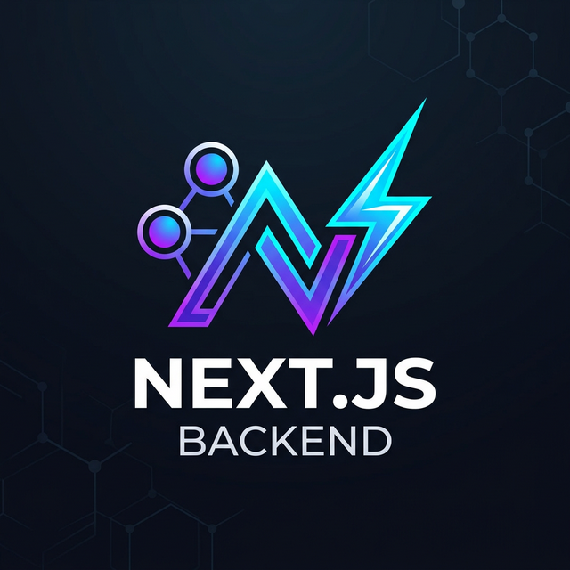

<p align="center">
  
</p>

# Next.js Backend (Elysia Nest-like Library)

Một thư viện backend mạnh mẽ, tốc độ cao dành cho Node/Bun, được xây dựng trên nền tảng **ElysiaJS**. Nó mang kiến trúc **NestJS** quen thuộc và có tính cấu trúc cao (Decorators, Dependency Injection, Modules, Guards, Interceptors) đến với hệ sinh thái Elysia siêu tốc.

Được thiết kế tỉ mỉ để sẵn sàng cho **Serverless & Edge**, dễ dàng tích hợp trực tiếp vào Next.js App Router API endpoints thông qua `next-js-backend`.

---

## 🚀 Tính Năng (Features)

- **Kiến trúc giống NestJS**: Cấu trúc ứng dụng của bạn với `@Controller`, `@Injectable`, và `@Module`.
- **Lõi ElysiaJS**: Hoạt động dựa trên ElysiaJS và Bun, mang lại hiệu suất tối đa cùng với sự tích hợp TypeBox.
- **Dependency Injection**: Vùng chứa IoC siêu mạnh với đầy đủ tính năng, hỗ trợ `useClass`, `useValue`, `useFactory` và injection qua constructor tiêu chuẩn.
- **Quy trình xử lý (Pipeline)**:
  - **Guards** (`@UseGuards`): Xác thực và phân quyền.
  - **Interceptors** (`@UseInterceptors`): Ghi log request/response, thay đổi và biến đổi dữ liệu.
  - **Pipes** (`@UsePipes`): Xác thực định dạng dữ liệu (hỗ trợ tích hợp sẵn `ValidationPipe` với `class-validator`).
  - **Filters** (`@UseFilters`, `@Catch`): Quản lý luồng ngoại lệ (Custom Exception Handlers) toàn cục & theo cấp độ.
- **Quản lý Phiên (Session)**: Module `SessionModule` tích hợp sẵn dùng Cookie với hệ thống lưu trữ có thể cắm ghép (Redis/DB/Memory).
- **Core Modules**: Tích hợp sẵn `ConfigModule` (Xác thực tham số môi trường Env), `JwtModule` (Xác thực token) và `LoggerService`.
- **Next.js API Routes**: Tương thích tức thì theo dạng drop-in với `export const { GET, POST } = bootstrap()`.
- **Tải lên File (File Uploads)**: Hỗ trợ tự nhiên cho `@File()` / `@Files()` thông qua `multipart/form-data`.
- **OpenAPI / Swagger**: Hỗ trợ xuất sắc nhất thông qua các plugin gốc của Elysia.

---

## 📦 Công Nghệ Sử Dụng (Tech Stack)

- **Runtime**: [Bun](https://bun.sh/)
- **Core Server**: [ElysiaJS](https://elysiajs.com/)
- **Validation**: [TypeBox](https://github.com/sinclairzx81/typebox) (Elysia gốc) & [class-validator](https://github.com/typestack/class-validator)
- **Metadata**: `reflect-metadata`

---

## 🛠️ Bắt Đầu Cài Đặt (Getting Started)

### Cài đặt thư viện

```bash
# Clone repository hoặc chạy lệnh này trong dự án của bạn
bun install next-js-backend
```

### Chạy các Ứng Dụng Mẫu (Samples)

Chúng tôi cung cấp một số ứng dụng mẫu trong thư mục `samples/` để giúp bạn làm quen nhanh chóng:

```bash
# Mô hình Controller & DI Cơ bản
bun run start:basic

# Xác thực định dạng DTO với class-validator
bun run start:validation

# Luồng Guards và Interceptors
bun run start:guards

# Tài liệu OpenAPI Swagger (Chạy trên cổng 3003)
bun run start:swagger
```

---

## 📖 Các Khái Niệm Cốt Lõi (Core Concepts)

### 1. Controllers & Routing

Controller có trách nhiệm nhận các request đổ về và trả response cho phía client. Sử dụng các khai báo (decorators) điều hướng định tuyến (`@Get`, `@Post`, v.v.) và khai báo trích xuất thông tin tham số (`@Body`, `@Param`, `@Query`, `@Headers`, `@Req`, `@Res`, `@Session`, `@File`, `@Files`) để lấy dữ liệu gửi lên một cách dễ dàng.

```typescript
import { Controller, Get, Post, Body, Param } from "next-js-backend";

@Controller("/users")
export class UsersController {
  @Get()
  getAllUsers() {
    return [{ id: 1, name: "Alice" }];
  }

  @Post()
  createUser(@Body() body: any) {
    return { success: true, data: body };
  }
}
```

### 2. Dependency Injection (Tiêm Phụ Thuộc - Services)

Hãy gắn nhãn `@Injectable()` vào các hàm Service để chúng có thể được inject (tiêm thông qua constructor) vào trong Controllers hoặc các service chức năng khác.

```typescript
import { Injectable, Controller, Get } from "next-js-backend";

@Injectable()
export class UsersService {
  getUsers() {
    return ["Alice", "Bob"];
  }
}

@Controller("/users")
export class UsersController {
  constructor(private readonly usersService: UsersService) {}

  @Get()
  get() {
    return this.usersService.getUsers();
  }
}
```

### 3. Pipeline Xác Thực (Validation)

Bạn có thể tự do tiến hành validation định dạng dữ liệu đầu vào sử dụng **TypeBox** (Cách gốc của Elysia) hoặc **class-validator** (Cách tiêu chuẩn của NestJS).

**Sử Dụng Class Validator (Định dạng DTO):**

````typescript
import { IsString, IsEmail } from "class-validator";
import { Body, Post, Controller, UsePipes, ValidationPipe } from "next-js-backend";

class CreateUserDto {
  @IsString()
  name: string;

  @IsEmail()
  email: string;
}

@Controller("/users")
export class UsersController {
  @Post()
  @UsePipes(new ValidationPipe())
  create(@Body() dto: CreateUserDto) {
    return dto;
  }
}
```ư

### 4. Guards & Interceptors

**Guards** sẽ quét và xác định xem Request có quyền được đi tiếp vào Route Handler (tức các Controller) hay bị bắt dừng lại.
**Interceptors** có thể gắn bổ sung logic ở trước / và sau sự kiện thực thi Route Methods.

```typescript
import { CanActivate, Context, NextInterceptor } from "next-js-backend";

export class AuthGuard implements CanActivate {
  async canActivate(context: Context): Promise<boolean> {
    const token = context.request.headers.get("authorization");
    return token === "Bearer secret";
  }
}

export class LoggingInterceptor implements NextInterceptor {
  async intercept(context: Context, next: () => Promise<unknown>) {
    console.log("Before execution...");
    const result = await next();
    console.log("After execution...");
    return result;
  }
}
````

Sử dụng các lớp này trực tiếp bằng các `@Use` (decorators):

```typescript
@UseGuards(AuthGuard)
@UseInterceptors(LoggingInterceptor)
@Get('/secure')
getSecureData() { ... }
```

### 5. Exception Filters (Xử Lý Lỗi)

Giành quyền làm chủ toàn diện vòng đời Lỗi / Response. Bắt các ngoại lệ `Error` đột xuất trực tiếp trên cấp bậc Route hoàn toàn giống hệt NextJS.

```typescript
import {
  Catch,
  ExceptionFilter,
  UseFilters,
  Controller,
  Get,
} from "next-js-backend";

class CustomError extends Error {}

@Catch(CustomError) // Catch only CustomError
export class MyExceptionFilter implements ExceptionFilter {
  catch(exception: CustomError, context: any) {
    context.set.status = 503;
    return {
      message: "Internal Logic Overridden",
      errorDetails: exception.message,
    };
  }
}

@Controller("/users")
export class UsersController {
  @Get()
  @UseFilters(MyExceptionFilter)
  crash() {
    throw new CustomError("Oh no!");
  }
}
```

### 6. Bootstrapping & Tích Hợp Next.js App Router

Tổ hợp và gộp ứng dụng của bạn lại thông qua hệ thống `@Module` và khởi động (bootstrap) nó bằng hàm thư viện `ElysiaFactory`. Bạn có thể trích xuất ra một fetch handler tên là `app.handle` để gắn trực tiếp và chạy Native ngay lập tức trên các routes của Next.js Edge / API.

**Cho Môi trường Máy Chủ Độc Lập (Standalone JS Server):**

```typescript
import { Module, ElysiaFactory } from "next-js-backend";

@Module({
  controllers: [UsersController],
  providers: [UsersService],
})
class AppModule {}

async function bootstrap() {
  const app = await ElysiaFactory.create(AppModule);
  app.listen(3000, () => {
    console.log(`Server started on port 3000`);
  });
}
bootstrap();
```

**Cho Môi trường Next.js App Router (app/api/[...slug]/route.ts):**

```typescript
import { ElysiaFactory } from "next-js-backend";
import { AppModule } from "./app.module";

// Hàm hỗ trợ "createNextJsHandlers" giải quyết tự động Singleton Pattern
// và tối ưu Cold-Start cho ứng dụng Next.js Edge/Serverless.
export const { GET, POST, PUT, PATCH, DELETE } =
  ElysiaFactory.createNextJsHandlers(AppModule, {
    globalPrefix: "/api",
  });
```

### 7. Các Module Tích Hợp Sẵn (Enterprise Features)

Thư viện này cung cấp sẵn cho bạn các Modules nội bộ, tiện lợi và vô cùng bảo mật để chạy nhanh dự án khi bootstrap ứng dụng:

**ConfigModule (Xác thực thông số môi trường - Environment):**

```typescript
import { ConfigModule } from 'next-js-backend';
import { t } from 'elysia';

@Module({
  imports: [
    ConfigModule.forRoot({
      isGlobal: true,
      schema: t.Object({
        DATABASE_URL: t.String(),
        PORT: t.Numeric({ default: 3000 }),
        JWT_SECRET: t.String()
      })
    })
  ]
})
```

**JwtModule, AuthGuard & PasswordService (Mã hóa mật khẩu):**

```typescript
import {
  JwtModule,
  AuthGuard,
  PasswordService,
  UseGuards,
  Controller,
  Get,
} from "next-js-backend";

@Module({
  imports: [JwtModule.register({ secret: "my-super-secret", expiresIn: "1h" })],
  providers: [PasswordService],
})
class AuthModule {}

@Controller("/profile")
@UseGuards(AuthGuard)
export class ProfileController {
  constructor(private password: PasswordService) {}

  @Get("/me")
  async getSecretData() {
    const hash = await this.password.hash("mypassword", {
      algorithm: "argon2id",
    });
    return { status: "Secure data", hash };
  }
}
```

**SessionModule (Giải pháp lưu trữ Cookie bảo mật cao):**

```typescript
import { SessionModule, Controller, Get, Session } from "next-js-backend";

@Module({
  imports: [
    SessionModule.register({
      secret: "super-secret", // Signs the Cookie
      cookieName: "sid",
      ttl: 86400, // 1 day expiration
    }),
  ],
})
class WebAppModule {}

@Controller("/profile")
export class ProfileController {
  @Get("/me")
  getProfile(@Session() session: SessionData) {
    return session || { message: "Not logged in via cookie!" };
  }
}
```

**Built-in LoggerService (Ghi Log Hệ Thống):**

```typescript
import { Logger } from "next-js-backend";

const logger = new Logger("MyContext");
logger.log("Standard log message");
logger.error("Error occurred", error.stack);
logger.warn("Warning log");
```

## 🌍 Mở Rộng Type Toàn Cục (Global Type Augmentation)

Để lấy được tối đa sự an toàn Typescript (Type safety) khi sử dụng các phương pháp lấy biến động `@Session()` hay xử lý trong custom Guards, thư viện bóc tách các Types chuẩn bị sẵn (mở) Global interfaces cho bạn can thiệp từ `.d.ts` (ví dụ, chèn code vào file `globals.d.ts` hoặc `next-env.d.ts` của repository bạn).

```typescript
// types.d.ts
import "next-js-backend";

declare module "next-js-backend" {
  interface SessionData {
    userId: string;
    role: "admin" | "user";
    preferences: { theme: string };
  }

  interface User {
    id: number;
    email: string;
    isActive: boolean;
  }
}
```

Và giờ đây, bất kì lúc nào bạn tiến hành dùng decorater `@Session() session`, Trình soạn thảo IDE của bạn đều sẽ gợi ý lệnh (auto-complete) rất hoàn hảo như thuộc tính `session.role` hay `session.userId`!

---

## 🧪 Testing (Chạy Thử Nghiệm)

Chúng tôi sử dụng môi trường test trực tiếp thông qua runner của Bun (`bun:test`). Tất cả files cấu hình bài test nghiệm thu thư mục nguồn (source) đều chứa bên trong thư mục `__tests__` đi liền cạnh.

```bash
bun test
```

---

## 💖 Lời Cảm Ơn (Acknowledgements)

Đặc biệt gửi lời cảm ơn tới **Antigravity** (Google DeepMind) đã đồng hành, hỗ trợ kỹ thuật và giúp tôi hiện thực hóa toàn bộ ý tưởng của Thư viện này từ những dòng code đầu tiên. Cùng với sức mạnh của tinh thần pair-programming, **Next.js Backend** đã ra đời!

---

## 📜 Giấy Phép (License)

**MIT License**

Copyright (c) 2026 Tuan Nguyen

Permission is hereby granted, free of charge, to any person obtaining a copy
of this software and associated documentation files (the "Software"), to deal
in the Software without restriction, including without limitation the rights
